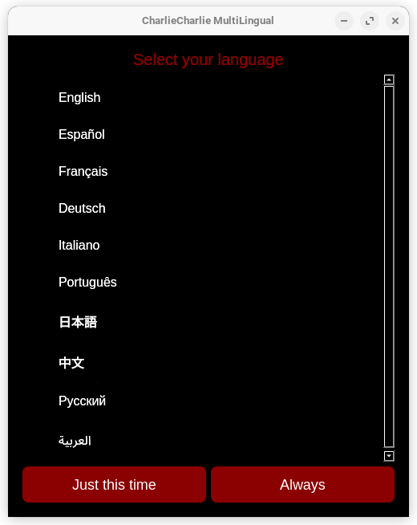
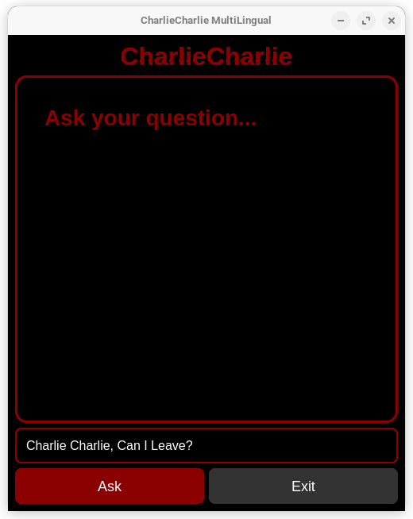

# 🔮 CharlieCharlie MultiLingual

 

Un juego místico de preguntas/respuestas estilo "Charlie Charlie" con:
- **Traducción en tiempo real** (10+ idiomas)
- **Efectos visuales glitch** 
- **Interfaz estilo posesión** (rojo/negro)
- **Resistencia paranormal al cierre**

## 🌍 Idiomas soportados
| Idioma       | Código |
|--------------|--------|
| English      | `en`   |
| Español      | `es`   |
| Français     | `fr`   |
| Deutsch      | `de`   |
| Italiano     | `it`   |
| Português    | `pt`   |
| 日本語        | `ja`   |
| 中文          | `zh`   |
| Русский      | `ru`   |
| العربية      | `ar`   |

---

## 🚀 Instalación
1. **Requisitos**:
   ```bash
   pip install PyQt5 requests pygame
   ```

2. **Ejecutar**:
   ```bash
   python charliecharlieml.py
   ```

---

## 🎮 Cómo jugar
1. Selecciona tu idioma al iniciar
2. Haz cualquier pregunta al tablero
3. Recibe respuestas aleatorias (SÍ/NO)
4. Para salir: pregunta *"¿Me puedo salir?"* (debe responder "SÍ")

> ⚠️ El juego **resistirá tu intento de cerrarlo** si no obtienes permiso

---

## 🛠️ Configuración
Los ajustes de idioma se guardan en:
```
config/settings.json
```

---

## 📌 Notas técnicas
- Usa la API pública de Google Translate
- Efectos visuales implementados con Qt (sin dependencias externas)
- Diseño responsive para diferentes pantallas

---

## 📜 Licencia
MIT License - Libre para uso y modificación

---

**¿Encontraste un bug?**  
Abre un *issue* o contribuye al proyecto!

---

### 🔥 Features destacables:
- **Sistema de traducción dinámica**  
- **Efectos de glitch nativos** (sin pygame)  
- **Interfaz "poseída"** con animaciones  
- **Persistencia de configuración**  

¿Quieres que añada algo más específico? 😊
